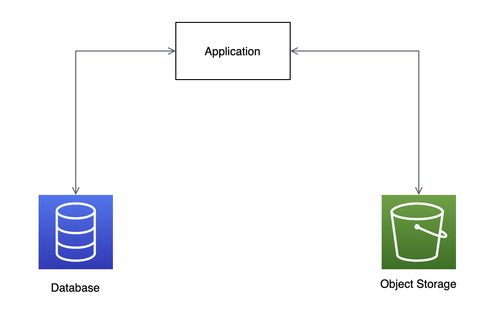
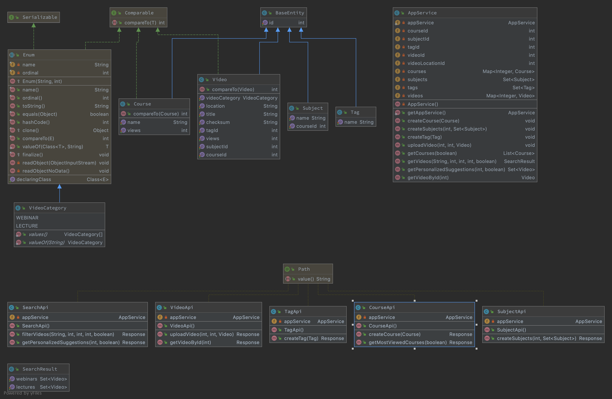

# Proximity Backend Engineering Challenge

## Problem Statement
You need to build a Rest API where an instructor and student manage their Webinars & Courses. 
A Creator can create course, subjects, tags and they can upload videos and webinars to the system. 
Lessons & webinars can be present in multiple courses and subjects. 
A Student can then search for webinars and/or videos using webinar title, video title, course name and subject name, and can filter using course, subjects and tags. 
Build the application keeping in mind that data duplicacy and time complexity should be minimized.

## User Stories
1. As an instructor, I can upload a webinar.
2. As an instructor, I can create, edit, delete course.
3. As an instructor, I can create, edit, delete subjects.
4. As an instructor, I can create, edit, delete tags.
5. As an instructor, I can upload a video.
6. As an instructor, I can add new tag while uploading video or webinar.
7. As an instructor, I can see the most viewed videos, courses and webinars.
8. As a student, I can see list of webinars & videos.
9. As a student, I can search webinars & videos by title.
10. As a student, I can filter webinars & videos by course, subjects, tags.
11. As a student, when I am playing a video or a webinar, I can get personalized suggestions of courses/webinars.

## Architectural overview

#### Application
Application will provide the list of REST APIs and business logic to process and upload videos to Object storage.
The text and metadata about videos and webinars will be stored in a database.
##### Avoid Duplicates
Uploading duplicate videos and webinars will be avoided by comparing video metadata like checksum, video size etc.
If lessons or webinars has to be present in multiple courses or subjects, the location metadata of the video pont to same video in object storage. So there will be no duplicate videos.
#### Database
We will be storing all text information in a database. This includes, courses, subjects, metadata of lecture and webinar videos.
#### Object Storage
We will be storing the lesson and webinar videos in Object storage. Before uploading video to object storage, duplication of the vieo will be verified from application based on checksum and other metatdata.
The metadata lookup will be maintained in a database.

### Class Diagram

### Endpoints
POST v1/course  
POST v1/course/{courseId}/subject  
POST v1/tag  
POST v1/course/{courseId}/subject/{subjectId}/video  
GET v1/course/{courseId}/subject/{subjectId}/video/{videoId}  
GET v1/search  
GET v1/search?title={title}  
GET v1/search?course={course}&subject={subject}&tag={tag}   
GET v1/search/{videoId}?suggestions  
GET v1/search?mostViewedVideos  
GET v1/course?mostViewed  

## Tools and technologies
Java 8  
Dropwizard  
Maven  

## What can be improved and how?
1. Place distributed redis cache between DB and application. 
This can be used keep data of mostly viewed lectures and webinars and lookup table of video metadata.
By using distributed cache here, we can gain significant performance gain.
2. Containerize the application and deploy in cloud using kubernetes. 
Make use of observability tools like prometheus etc and set alarms.
This will help to reduce operational cost.
